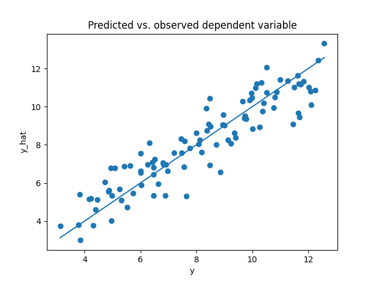

# Multivariant Linear Regression
A Python implementation of multivariant linear regression with focus on the statistical analysis of the coefficients.

## 1 - Objective
The project provides a Python-based implementation of the ordinary least squares linear regression method. The purpose is purely pedagogical and it closely mirrors the [scikit-learn's LinearRegression class](https://scikit-learn.org/stable/modules/generated/sklearn.linear_model.LinearRegression.html). This implementation gives some emphasis to the statistical analysis of the linear regression coefficients. In particular, the code computes the standard errors and confidence intervals for the coefficients and their $p$-value against the hypothesis that there is no relation between dependent and preditor variables, as well as the coefficient of determination $R^2$ and the $F$-statistic for the model. These quantities are relevant to assess the accuracy for the estimation of the regression coefficients, the (linear) dependence of the dependent variable $y$ of the predictors $X$ and the overall quality of the fit with the data.

## 2 - Repo organisation
**`linear_regression/`: The linear regression modules**
- It contains the multivariant linear regression module. See also Module architecture below.

**`notebooks/:` Notebooks demonstrating the modules**
- `LinearRegression.ipynb`: Notebook discussing the basics of linear regression 

## 3 - Module architecture
Description of the `linear_regression` module architecture.
- `linear_regression/__init__.py`
  - Initialises the module.
  - Imports the LinearRegressor class, for multivariant linear regression.

- `linear_regression/multivariant_linear_regression.py`: defines the LinearRegressor class with the methods
  - `fit`;
  - `predict`; 
  - `score`;
  - `get_params`;
  - `regression_report`.

## 4 - Features
- The `LinearRegressor` class:
  - performs an multivariant linear regression by minimizing the residual sum of squares using the SVD method to obtain the linear system solution;
  - predicts the values $\hat{y}$ of the dependent variable $y$ using the estimates for the coefficients from the predictor values $X$;
  - produces a statistical analysis of the coefficient estimates;
  - has the following methods:
    - `fit` fits the linear model,
    - `predicts` predicts using the linear model,
    - `score` returns the coefficient of determination $R^2$ and the $F$-statistic,
    - `get_params` gets the estimation of the regression coefficients,
    - `regression_report` returns a report on the statistical analysis of the estimators's coefficients, with confidence interval at 95% confidence level, standard error and $p$-value against the null hypothesis.

## 5 - Results

To test and illustrate the `LinearRegressor` class, we generate the artificial data assuming the model 
```math
y = 2.1 + 3.78 x_1 + 7.56 x_2 + 1.29 x_3 + \epsilon,
```
with $\epsilon$ is a normally distributed random error centred at zero and dispersion 1.0. The plot below shows the predicted versus the observed values for the dependent variable $y$. We have used 100 samples for this plot.

<br><br>
<div align="center">



*Figure 1: Predicted vs. observed values for the target with 100 samples.*

</div>
<br><br>

Using the method `score`, the class returns a statistical analysis of the model by computing the residual standard error, the coefficient of determination $R^2$, the $F$-statistic and the $p$-value. The last two quantities are related to the test of the hypothesis that all the predictors's coefficients are zero versus the alternative that at least one of the coefficients is non-zero.

</div>
<br><br>

<div align="center">

|       quantity      |  value   |
|:-------------------:|:--------:|
| residual std. error |  1.0029  |
|        $R^2$        |  0.8469  |
|    $F$-statistic    | 177.0768 |
|      $p$-value      |   0.0    |

*Table 1: Scores for the linear regression problem.*

</div>
<br><br>

The method `regression_report` returns a report on the statistical analysis for each of the estimators's coefficients. It gives the confidence interval at 95% confidence level, the standard error and $p$-value for to reject the hypothesis that the coefficient is null.

</div>
<br><br>

<div align="center">

|           | coefficient | confidence interval @ 95.0% | std. error | p-value |
|----------:|------------:|----------------------------:|-----------:|--------:|
| intercept |    2.3718   |       [1.7778, 2.9657]      |   0.2992   |< 0.0001 |
|   coef_1  |    2.8989   |       [2.1736, 3.6241]      |   0.3654   |< 0.0001 |
|   coef_2  |    7.5535   |       [6.8090, 8.2980]      |   0.3750   |< 0.0001 |
|   coef_3  |    1.6406   |       [0.9870, 2.2941]      |   0.3292   |< 0.0001 |

*Table 2: Regression report for linear regression problem.*

</div>
<br><br>


## 6 - Bibliography

- [G. Loiola Silva, *Notas de Probabilidade e Estatística* (2024)](https://www.math.tecnico.ulisboa.pt/~gsilva/PE_slides-print.pdf).
- [K. Silva Conceição, *Estatística I*](https://sites.icmc.usp.br/frasson/Estat/material/Estatistica-I-Katiane.pdf).
- G. James, D. Witten, T. Hastie and R. Tibshirani, *An Introduction to Statistical Learning*, Springer (2017).
- M.N. Magalhães and A.C. Pedroso de Lima, *Noções de Probabilidade e Estatística*, Edusp (2023).
